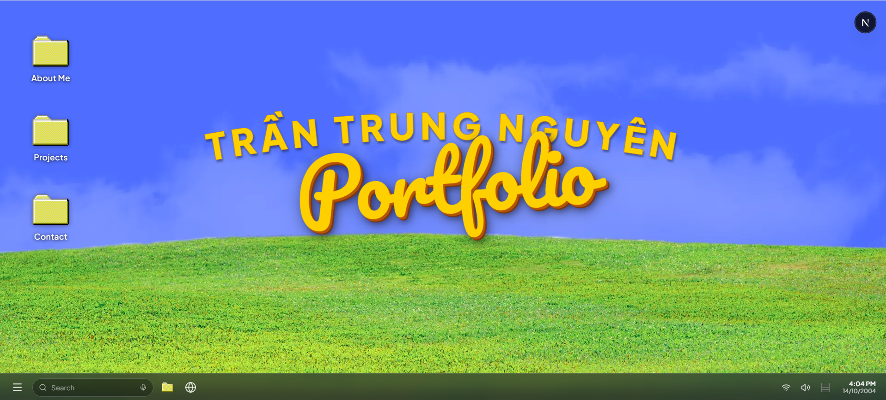

# 🖥️ Trần Trung Nguyên — Windows OS Portfolio

  
  
  
  
  
  

---

---

## 📖 Overview

**Windows OS Portfolio** is a Porfolio website of **Trần Trung Nguyên**.

## 📬 Contact

- **Full Name**: Trần Trung Nguyên
- **Role**: Full-Stack Web Developer
- **Email**: [trtrnguyen14104@gmail.com](mailto:trtrnguyen14104@gmail.com)
- **Phone**: `(+84) 354 066 043`
- **GitHub**: [@trtrnguyen14104](https://github.com/trtrnguyen14104)
- **LinkedIn**: [Trần Trung Nguyên](https://linkedin.com/in/trung-nguyên-trần-82b1403b8)
- **Living in**: TP. Hồ Chí Minh, Việt Nam 🇻🇳

---

  Designed and developed with passion by <strong>Tran Trung Nguyen</strong> © 2026.

