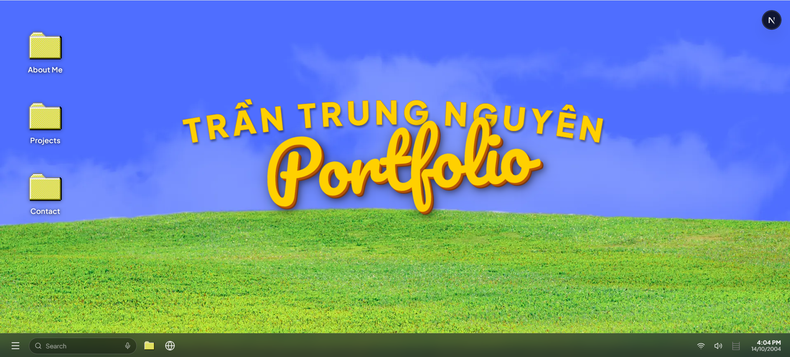

# 🖥️ Tran Trung Nguyen — Windows OS Portfolio

  <strong>An interactive, retro-modern Windows OS desktop portfolio built with Next.js 16, React 19, TypeScript, Tailwind CSS v4, and GSAP.</strong>

  
  
  
  
  
  

---

### 🌟 Desktop Demo Preview

---

## 📖 Overview

**Windows OS Portfolio** is the personal portfolio website of **Trần Trung Nguyên** (Full-Stack Developer). It simulates an authentic Windows operating system experience while blending it with a groovy 1970s retro aesthetic.

The site uses **GSAP (GreenSock Animation Platform)** to deliver lively window opening, dragging, minimizing and interaction behaviours that feel just like a real Windows machine.

## 📬 Contact

- **Full name**: Trần Trung Nguyên
- **Role**: Full-Stack Web Developer
- **Email**: [trtrnguyen14104@gmail.com](mailto:trtrnguyen14104@gmail.com)
- **Phone**: `0354066043`
- **GitHub**: [@trtrnguyen14104](https://github.com/trtrnguyen14104)
- **LinkedIn**: [Trần Trung Nguyên](https://linkedin.com/in/trung-nguyên-trần-82b1403b8)
- **Location**: Ho Chi Minh City, Vietnam 🇻🇳
